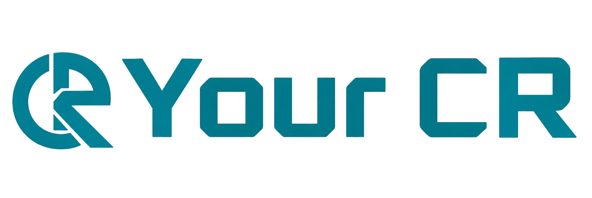

# Your CR — Manage Your Semester, Seamlessly.



**Your CR** is a comprehensive, high-performance semester management platform built specifically for university students and Class Representatives (CRs). It centralizes classes, exams, assignments, routines, and notices into one beautifully designed, lightning-fast dashboard.

---

## 🚀 Tech Stack

Built with cutting-edge web technologies to ensure maximum performance, scalability, and an exceptional developer experience:


### Core Frameworks & Deployment

- **Framework:** [Next.js 15 (App Router)](https://nextjs.org/)
- **Deployment Engine:** [Cloudflare Workers](https://workers.cloudflare.com/) & Cloudflare Pages
- **Serverless Adapter:** [OpenNext](https://opennext.js.org/) (Enables seamless Next.js App Router deployment on Cloudflare)

### UI & Styling

- **Styling:** [Tailwind CSS v4](https://tailwindcss.com/)
- **UI Components:** [Shadcn UI](https://ui.shadcn.com/) (Accessible, customizable, and headless)
- **Icons:** [Lucide React](https://lucide.dev/)

### Language & Tooling

- **Language:** [TypeScript](https://www.typescriptlang.org/) (Strict type safety)
- **Code Quality:** ESLint & Prettier
- **Data Validation:** Zod / Yup

---

## 📁 Strict Project Architecture

We follow a highly modular, scalable architecture to keep the codebase clean and maintainable.

```text
src/
├── app/                  # Next.js App Router (Pages & Layouts)
│   ├── (main)/           # Route Group: Public Landing Pages
│   ├── (dashboard)/      # Route Group: Authenticated User Dashboard
│   └── (auth)/           # Route Group: Authentication (Login/Register)
├── actions/              # Next.js Server Actions (Forms & Mutations)
├── services/             # External API fetch calls (Axios/Fetch)
├── validations/          # Zod/Yup Schemas for server & client validation
└── components/           # UI Components (Grouped strictly by feature)
    ├── auth/             # Auth-specific client components
    ├── dashboard/        # Dashboard-specific components (Charts, Sidebar)
    ├── main/             # Public landing page components
    ├── layout/           # Global layout elements (Navbar, Footer)
    ├── shared/           # Reusable cross-feature components
    └── ui/               # Generic Shadcn or base components
```

---

## 🛠️ Code Conventions & Best Practices

To maintain code quality, all contributors must adhere to these guidelines:

1. **Units (rem vs px):** Always use `rem` for margins, paddings, and typography to ensure perfect accessibility and scaling. Only use `px` for strict borders (e.g., `1px solid`).
2. **Component Colocation:** Never clutter the global `components` folder. Group components strictly by their feature (e.g., `src/components/dashboard/`).
3. **Container Usage:** Always use the globally defined `.container` utility class for layout widths, rather than hardcoding paddings and max-widths.
4. **Path Aliasing:** Use the `@/` prefix for all absolute imports (e.g., `@/components/ui/button`).
5. **Server Actions:** Prioritize using Server Actions (`"use server"`) inside the `src/actions/` directory for mutations and form handling.

---

## 💻 Getting Started

Follow these steps to run the project locally.

### 1. Clone the repository

```bash
git clone https://github.com/rakib/your-cr.git
cd your-cr
```

### 2. Install dependencies

```bash
npm install
```

### 3. Run the development server

```bash
npm run dev
```

Open [http://localhost:3000](http://localhost:3000) with your browser to see the application.

### 4. Cloudflare Local Preview (OpenNext)

To test the Cloudflare Workers build locally:

```bash
npm run preview
```

---

## 👤 Author

Developed and maintained with ❤️ by **[Rakib](https://github.com/rakib)**.
